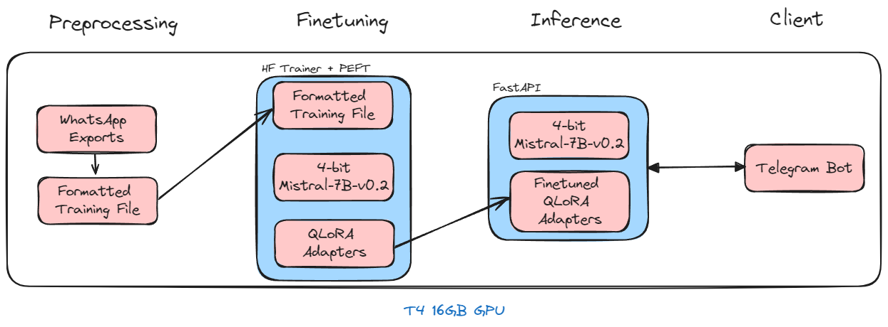
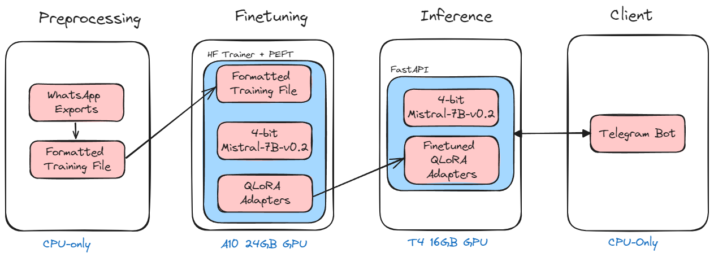

# Finetuning your Clone - Building Your Own Bot Trained on Your WhatsApp Messages

Would you like to create a Telegram bot which can talk like you? 

If so, you have come to the right repo! You can find the code to finetune your own LLM on your WhatsApp conversations, serve it, and build a Telegram Bot for it here!

This repo is split into four sections: [preprocessing](preprocessing), [finetuning](finetuning), [inference](inference), and [telegram_bot](telegram_bot), each with its own README file and requirements.txt. 

You can use a single machine and virtual environment to run all four steps as follows:

If you are doing a single machine set-up, you will just need a single virtual environment to install the dependecies from the different `requirements.txt` files.

Alternatively, you can use the following set-up like me where a high GPU memory machine is used for finetuning, a low GPU memory machine for inference, and CPU only machines for preprocessing and hosting the Telegram bot. This provides better resource allocation as I can finetune faster on the A100 instance. The downside is that you would have to move files around and set up different virtual environments for each step.

## Preprocessing Data
The first thing you need to do is to export your WhatsApp messages and preprocess the data into a file which can be used for LLM training. Follow the [README file in the preprocessing folder](preprocessing/README.md) to do this. At the end of this step, you will get a `jsonl` file which is a consolidation of your WhatsApp chats, formatted for LLM training, in the format `<start_header_id>system<end_header_id>your_message<|eot_id|><start_header_id>user<end_header_id>your_friends_message<|eot_id|>`. This can be done on a CPU-only machine.

## Finetuning
This step requires a machine which has a GPU with at least 16GB GPU RAM and supports bfloat training (e.g. A10 24GB). Copy the training file generated from the previous step to this machine by following the steps in the [README file in the finetuning folder](finetuning/README.md).

Finetuning is done using 4-bit QLoRA on a [Mistral-7B-v0.2 base model](https://huggingface.co/mistral-community/Mistral-7B-v0.2), with the following settings:
- `max_length`=3000
- `lora_r`=32
- `lora_alpha`=64
- `lora_dropout`=0.05
- `epochs`=5
- `batch_size`=1
- `gradient_accumulation_steps`=8 (to get an effective batch size of 8)

At the end of this step, you will get the LoRA adapters which consists of three files:
- `adapter_config.json`
- `adapter_model.safetensors`
- `training_args.bin`

## Hosting Finetuned Model for Inference
This step requires a machine which has a GPU with at least 8GB GPU RAM (e.g. T4). Copy the adapter files over to this machine and follow the steps in the [README file in the inference folder](inference/README.md) to deploy your model as a FastAPI service.

At the end of this step, you will have a FastAPI service deployed at `http://your_url:your_port_no/generate` e.g. `http://localhost:8080/generate/`

## Building the Telegram Bot
Deployment of your Telegram Bot requires only a small machine with a single CPU and 4GB RAM. Follow the steps in the [README file in the telegram_bot folder](telegram_bot/README.md) to deploy your telegram_bot.

That's all! You now have a Telegram bot which talks like you!

## References

Reference was made to the following notebooks:
- [WhatsApp data preprocessing](https://colab.research.google.com/drive/1Xf_FoKMxKd-RHdo4mPNVpTu__8tCGRgB#scrollTo=dYnFubkFJDEm) from [Daniel Pleus](https://www.linkedin.com/in/daniel-pleus/). Blog post [here](https://www.linkedin.com/pulse/building-chatbot-fine-tune-llms-whatsapp-data-daniel-pleus/).
- [Finetuning](https://github.com/brevdev/notebooks/blob/main/mistral-finetune-own-data.ipynb) from [Brev.dev](https://github.com/brevdev)

